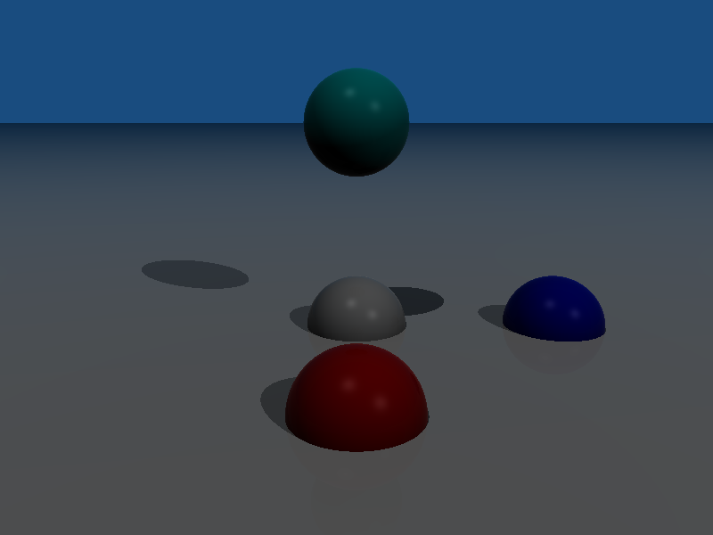
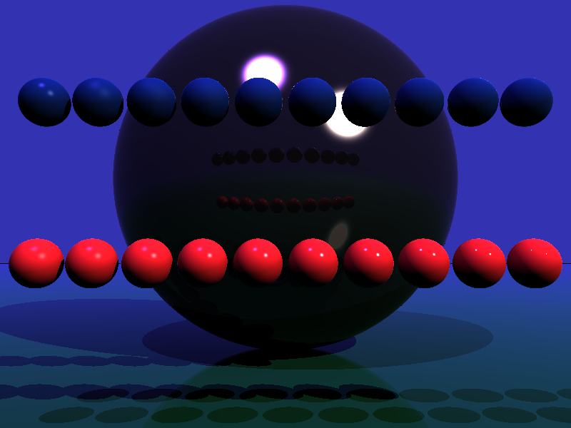
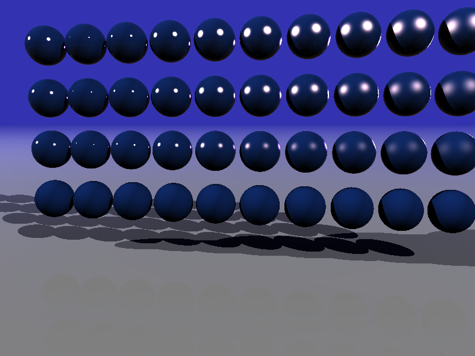
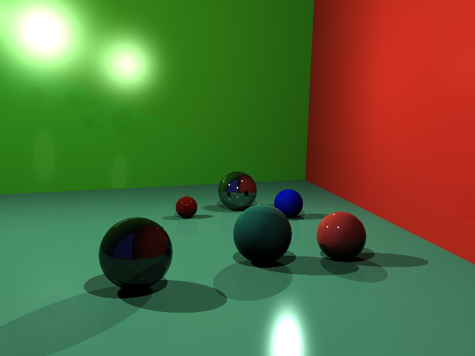
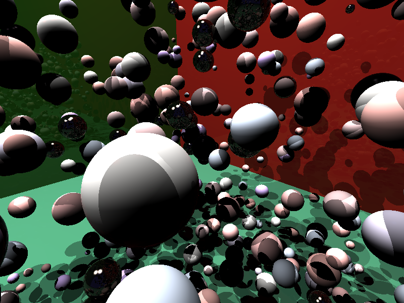

En résumé : l'intégralité des chapitres 1 et 2 ont pu être implémentés.   
En raison de contraintes de temps et de l'impossibilté de récupérer une partie de mon travail, laissé sur une machine de la fac, le chapitre 3 n'a pas pu être implémenté.  

## Chapitre 1 
La principale difficulté au niveau des premières fonctions a été de comprendre le sens de ce qu'il fallait faire, c'est à dire comprendre la signification pratique des formules données par l'énoncé, et comprendre le lien avec le code demandé (implémenter les formules est une chose, comprendre leur rôle dans notre programme en est uen autre).  Cependant cela n'a pas non plus représenté beaucoup de difficulté, car les indications données par l'énoncé restent claires, et l'approche pas-à-pas proposée avec le découpage de fonctions qui nous est donné rend la marche à suivre et l'organisation du code globalement straightforward.   

## Chapitre 2
Même idée ; peu difficulté à comprendre comment implémenter la partie Backmann/Fresnel/BSDF car à ce moment là le principe global est bien compris, et on reste globalement sur "chaque fonction implémente un calcul de manière claire". J'ai cependant passé plus de temps sur des erreurs d'implémentation du calcul, probablement car ceux-ci deviennent plus complexe et donc plus difficiles à débugger et, plus simplement, à écrire sans faire d'erreur d'étourderie.  

La partie réflexion m'a pris beaucoup plus de temps cependant, car j'ai mis du temps à comprendre le principe du rayon réfléchi, et la manière de l'implémenter (notament le fait de faire un appel récursif à trace_ray). J'ai en outre perdu beaucoup de temps sur un problème de segfault, qui était en réalité une récursion "infinie" (oubli de limiter le nombre de rebonds).

# Résultat 
Voici les images générée par mon programme, qui inclut donc les fonctionnalités suivantes : 
- Intersections entre rayon et objet
- ombres portées
- calcul des couleurs avec le modèle BSDF (beckmann, fresnel, etc)
- reflets

  
  
  
  