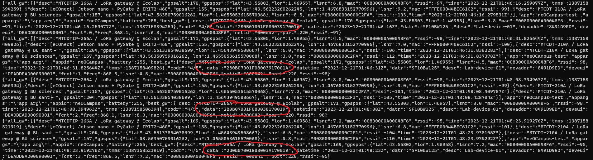
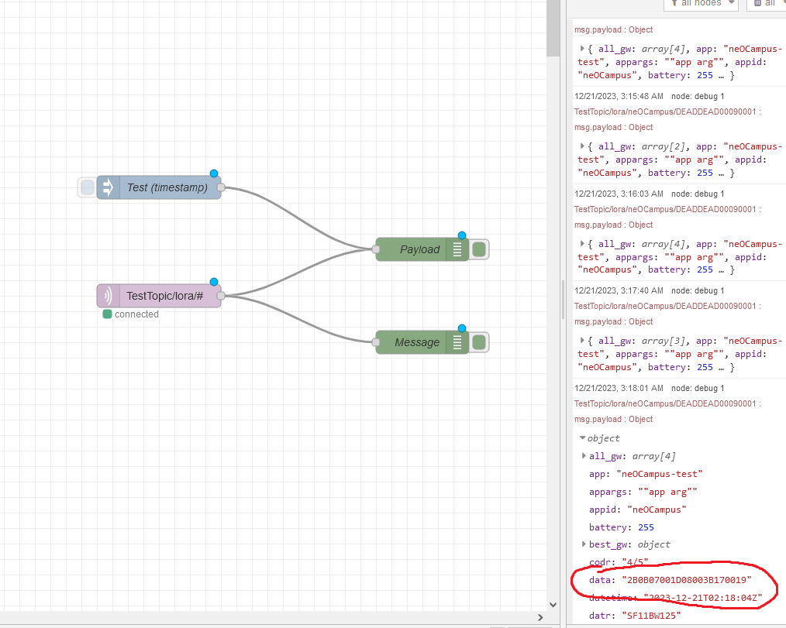

### Partie 1 

**q1)** 
Nous écrivons pour l'instant un programe python qui se contente de récupérer une valeur depuis les capteurs. Aucun problème à ce niveau, on passe alors à un fonctionnement où on récupère toutes les valeurs possibles périodement, en prenant soin de rendre le code modulaire pour faciliter les futures modifications. 

```py
#Il suffit d'itérer sur cet objet et appeler les lambdas à chaque fos 
simpleGetters = {
    "humidity": lambda sense : sense.get_humidity(),
    "tempFromHumid": lambda sense : sense.get_temperature_from_humidity(),
    "tempFromPres" : lambda sense : sense.get_temperature_from_pressure(),
    "pressure": lambda sense : sense.get_pressure()
}
```

Les capteurs IMU posent quelques difficultés d'utilisations : il faut les activer et désactiver manuellement ; en exclusion mutuelle. 
Même en suivant correctement ce fonctionnement, on constate un problème : leurs valeurs semblent cohérentes au lancement du programme, puis les valeurs suivantes ne correspondent plus à la réalité. Nous décidons d'ignorer ces capteurs là.  

Le fichier `q1-1.py` correspond à cette version du code (simple lecture des données)

**q2)** Nous testons également la fonctionnalité d'affichage de texte sur la matrice de LED, avec un programe qui affiche périodiquement toutes les valeurs données par ses capteurs sur la matrice. Cela fonctionne (voir code commenté dans notre main.py), mais nous décidons d'implémenter une visualisation plus avancée (et réactive). Celle-ci découpe la matrice en 4 bandes, dédiées aux 4 valeurs que nous mesurons (pression, humidité, température calculée à partir de l'humidité/de la pression), et les remplit plus ou moins en fonction de la valeur. 

  
(on peut voir les 4 bandes plus ou moins remplies en fonction des 4 mesures, de haut en bas humidité, température (basée sur humidité), température (basée sur pression), pression)

Le fichier `q-12.py` correspond à cette version du code (lecture des capteurs et mise à jour de la matrice en fonction)

**q3)**
On passe ensuite à l'encodage, qui se fait de manière très simple en utilisant le format NeOCayenne fourni sur moodle : il nous suffit d'importer la classe python NeoCayenneLPP et de l'instancier afin de créer la représentation d'une transmission ; un simple appel de méthode pour chaque donnée permet d'ajouter celle-ci. La fonction qui en résulte est la suivante : 
```py
def encode(temperaturePress, temperatureHumidity, pressure, humidity):
    lpp = NeoCayenneLPP()
    lpp.add_temperature(temperatureHumidity + temperaturePress / 2)
    lpp.add_pressure(pressure)
    lpp.add_humidity(humidity)

    return lpp
```

La valeur retournée étant simplement une instance de NeoCayenneLPP, il suffit d'appeler sa méthode `to_bytes()` pour obtenir les données brutes au format NeOCayenneLPP prêtes à être transmises. 

Le fichier `q1-3.py` contient seulement la fonction d'encodage.   

**q4**)
Bien qu'il soit beaucoup moins lisible par l'humain que JSON, NeoCayenneLPP compense par sa (beaucoup) plus grande légèreté : on transmet les données sous forme brute et non sous forme de représentation textuelle ; de plus, les données ne contiennent presque pas d'informations sur leur organisation interne (ordre et type des valeurs), ce qui rend les données encore plus légères en contrepartie de l'ajout d'une contrainte pour le développeur (nécessité que les différents processus communiquant entre eux connaissent déjà l'organisation des données à l'avance)

### Partie 2
On prend le DEVEUI `DEADDEAD00090003` (raspi n° 3)  

**q1**)
On ajoute maintenant les fonctionnalités permettant de rejoindre le réseau et d'y transmettre des données.  
Ces fonctions sont disponibles dans le fichier `q2-1.py`.  

Vous pouvez également trouver l'intégralité du programme à ce stade dans `main.py`.

Après envoi de quelques mesures, voici ce que nous donne Mosquitto Sub :  


Nos messages ont bien été envoyés (entouré en rouge, les données : ce sont les valeurs mesurées par les capteurs, formattées selon le format NeOCayenneLPP, représentées en hexadécimal)  

**q2)**

- On commence par installer Node-RED. Pour ne pas s'embêter avec Docker (désolé ...), je l'installe directement via node `npm -g ...` sur ma machine.  
- On lance node red avec la commande `node-red`
- On accède à l'éditeur via navigateur, à l'adresse `localhost:1880`. 
- Après placement d'un noeud Sub MQTT d'un noeud Debug récupérant la sortie de ce dernier (+ quelques noeuds Debug et Inject pour tester le tout), on a nos messages affichés.



Les données des capteurs sont entourées en rouge.  

## Difficultés

### Configuration du raspberry pi
On travaille sur notre raspberry pi auquel on accède depuis nos ordinateurs via SSH.  

Nous avons du installer python et sense-hat. Problème : pour pouvoir accéder aux Raspi, ces derniers doivent être connectés au réseau SECLI-305, qui n'a pas d'accès à internet ; l'installation doit donc se faire "manuellement" (via les archives de ces libs).  

Dans un premier temps nous ignorons que python n'est pas installé, donc on télécharge juste le fichier whl de la lib (qui peut être ensuite installé par pip), qu'on envoie ensuite sur le pi via scp.  
C'est le moment où on se rend compte que python n'est pas là, et ne voulant pas nous embêter avec l'installation manuelle de python, nous essayons d'abord de connecter le pi à internet. Pour cela on se résoud finalement à abandonner ssh pour l'instant et brancher le pi à un écran+clavier+souris. Il s'avère que l'OS du pi a été installé en mode headless, donc seul le terminal est accessible. Après plusieurs essais, nous ne parvenons pas à connecter le pi à un réseau wifi connecté à internet (même en utilisant un simple point d'accès android).  
On repasse donc finalement sur du ssh, on télécharge donc le code source de python sous forme d'archive, et on le téléverse vers le pi. On build/installe python à partir du code source : `./configure && make && make test`.  

### Réseau Lora
L'exploitation du réseau a parfois été compliquée. Il suffit de quelques personnes déjà en train de l'utiliser activement, travaillant sur ce TP par exemple, pour qu'on se retrouve avec des no_free_ch en boucle (ce qui est particulièrement un problème étant donné que nos EdT font qu'on est souvent beaucoup à travailler sur ce TP sur les mêmes timings). De plus, le réseau a parfois été carrément down. 