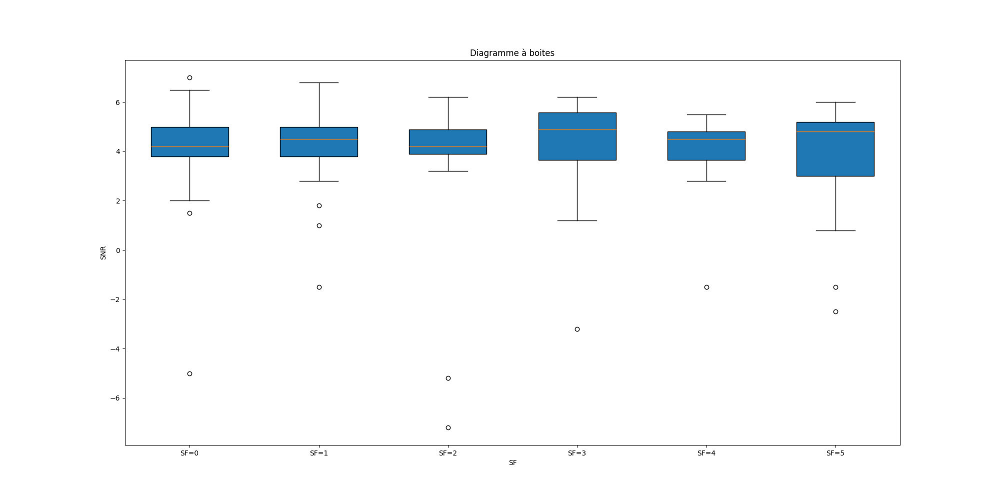

# TP Lorawan

## Exercice 1 et 2
Nous utilisons le deveui DEADDEAD00090004.  

Nous tentons dès le début d'envoyer des données, les exercices 1 et 2 sont donc plus ou moins faits en même temps.  

Après avoir effectué les quelques modifications nécessaires au fonctionnement du script python, il s'avès que la commande `mac set dr` nous renvoie une erreur, suite à quoi la connexion est refusée.  

.

Cette erreur finit par être résolue simplement en changeant la carte.  

Puis un `no_free_channel` quand on tente de rejoindre le réseau.

Nous constatons que l'utilisation simultanées d'une carte pour chaque binome pose problème au niveau du réseau. Même lorsque nous arrivons finalement à nous connecter, le broker nous renvoie `busy`quand nous tentons d'envoyer des données 

La majeure partie du reste du TP a donc été réalisée hors des heures alloueés.  

## Exercice 3
Nous observons les trames envoyées sur le réseau avec la commande :  
`sudo mosquitto_sub -h neocampus.univ-tlse3.fr -t TestTopic/lora/# -u test -P test`.  

## Exercice 4
Nous envoyons sucessivement 30 trames avec un dr de 0 à 5 sur le réseau (et un message contenant le DR afin de les identifier plus facilement une fois reçues sur mosquitto).  
Les trames reçues au niveau de mosquitto sont conservées dans un json avec la commande `sudo mosquitto_sub -h neocampus.univ-tlse3.fr -t TestTopic/lora/# -u test -P test > donnees.json`. 

### Résultats
La meilleure gateway dans tous les cas (pour tous les DR) est Ecolab. C'est sur cette gateway que nous nous basons pour l'analyse du RSSI/LSNR

### SNR par SR

### RSSI par SR

### Data extraction rate
