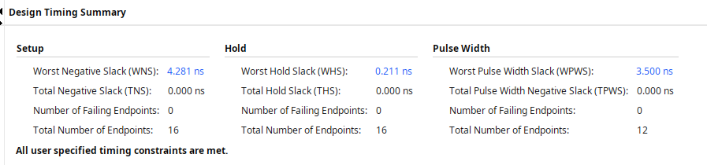

# TP PWM

## Partie 1 - Développement et implémentation du PWM

### Développement, simulation comportementale
Pas grand chose à dire sur le développement du code lui-même, vous pouvez trouver mon code dans le fichier pwm.vhd. 

Pour la simulation comportementale, on laisse les lignes 61-65 décommentées et les lignes 66-71 commentées dans le source de test (tst_pwm.vhd) : en l'absence de fichier tcl, il nous faut hardcoder les paramètres génériques.  

Résultat de la simul comportementale : 


### Synthèse

On passe maintenant à la synthèse. On va l'éffectuer deux fois : une avec des paramètres qui facilitent l'analyse la simulation post-synthèse, et une fois avec les "bons" paramètres pour le cas réel.  

On ajoute un fichier tcl, dont le contenu sera donc différent pour les 2 synthèses

Pour la simulation post-synthèse : `set_property generic {SYS_CLK=125000000 PWM_FREQ=6250000 DUTY_RES=4} [current_fileset]`.

La sortie de la synthèse nous confirme bien nos valeurs 

```
INFO: [Synth 8-638] synthesizing module 'pwm' [/nfs/home/camsi13/Documents/univ-documents/M2/SE/VHDL/TP1/pwm.vhd:40]
	Parameter sys_clk bound to: 125000000 - type: integer 
	Parameter pwm_freq bound to: 6250000 - type: integer 
	Parameter duty_res bound to: 4 - type: integer 
```

Rapport de synthèse : 

```
+-------------------------+------+-------+------------+-----------+-------+
|        Site Type        | Used | Fixed | Prohibited | Available | Util% |
+-------------------------+------+-------+------------+-----------+-------+
| Slice LUTs*             |   15 |     0 |          0 |     53200 |  0.03 |
|   LUT as Logic          |   15 |     0 |          0 |     53200 |  0.03 |
|   LUT as Memory         |    0 |     0 |          0 |     17400 |  0.00 |
| Slice Registers         |   11 |     0 |          0 |    106400 |  0.01 |
|   Register as Flip Flop |   11 |     0 |          0 |    106400 |  0.01 |
|   Register as Latch     |    0 |     0 |          0 |    106400 |  0.00 |
| F7 Muxes                |    0 |     0 |          0 |     26600 |  0.00 |
| F8 Muxes                |    0 |     0 |          0 |     13300 |  0.00 |
+-------------------------+------+-------+------------+-----------+-------+
```

```
+----------+------+---------------------+
| Ref Name | Used | Functional Category |
+----------+------+---------------------+
| FDRE     |    8 |        Flop & Latch |
| LUT6     |    7 |                 LUT |
| IBUF     |    7 |                  IO |
| LUT2     |    4 |                 LUT |
| LUT4     |    3 |                 LUT |
| LUT1     |    3 |                 LUT |
| FDSE     |    3 |        Flop & Latch |
| LUT5     |    2 |                 LUT |
| OBUF     |    1 |                  IO |
| LUT3     |    1 |                 LUT |
| BUFG     |    1 |               Clock |
+----------+------+---------------------+

```

Pour simuler, on inverse les lignes commentées/décommentée dans test_pwm.vhdl : cette fois, on ne hardcode plus les génériques, et on doit mapper les ports. 

Après un premier essai raté pour cause d'utilisation des mauvaises valeurs génériques ... 


... on arrive au bon résultat, pour la simulation post-synthèse FONCTIONNELLE


On passe maintenant à la simulation de timing post-synthèse : 


... qui nous donne n'importe quoi, ce n'est pas du tout le comportement attendu. A l'heure actuelle, je n'ai toujours pas réussi à trouver la raison ni une solution, sur conseil de l'encadrant du TP j'ai décidé de simplement continuer.  

On passe maintenant à la "vraie" synthèse : on change les valeurs dans le TCL : `set_property generic {SYS_CLK=125000000 PWM_FREQ=1 DUTY_RES=4} [current_fileset]`.  

Là aussi on confirme les valeurs avec la sortie : 
```
INFO: [Synth 8-638] synthesizing module 'pwm' [/nfs/home/camsi13/Documents/univ-documents/M2/SE/VHDL/TP1/pwm.vhd:40]
	Parameter sys_clk bound to: 125000000 - type: integer 
	Parameter pwm_freq bound to: 1 - type: integer 
	Parameter duty_res bound to: 4 - type: integer 
```

On remarque que le rapport de synhèse au niveau de certaines valeurs, assez drastiquement : 

```
+-------------------------+------+-------+------------+-----------+-------+
|        Site Type        | Used | Fixed | Prohibited | Available | Util% |
+-------------------------+------+-------+------------+-----------+-------+
| Slice LUTs*             |   46 |     0 |          0 |     53200 |  0.09 |
|   LUT as Logic          |   46 |     0 |          0 |     53200 |  0.09 |
|   LUT as Memory         |    0 |     0 |          0 |     17400 |  0.00 |
| Slice Registers         |   55 |     0 |          0 |    106400 |  0.05 |
|   Register as Flip Flop |   55 |     0 |          0 |    106400 |  0.05 |
|   Register as Latch     |    0 |     0 |          0 |    106400 |  0.00 |
| F7 Muxes                |    0 |     0 |          0 |     26600 |  0.00 |
| F8 Muxes                |    0 |     0 |          0 |     13300 |  0.00 |
+-------------------------+------+-------+------------+-----------+-------+
```

```
+----------+------+---------------------+
| Ref Name | Used | Functional Category |
+----------+------+---------------------+
| FDSE     |   36 |        Flop & Latch |
| LUT4     |   28 |                 LUT |
| LUT2     |   26 |                 LUT |
| FDRE     |   19 |        Flop & Latch |
| CARRY4   |   11 |          CarryLogic |
| LUT3     |    8 |                 LUT |
| IBUF     |    7 |                  IO |
| LUT1     |    4 |                 LUT |
| LUT6     |    3 |                 LUT |
| OBUF     |    1 |                  IO |
| LUT5     |    1 |                 LUT |
| DSP48E1  |    1 |    Block Arithmetic |
| BUFG     |    1 |               Clock |
+----------+------+---------------------+
```

Cela est du notament au fait que le compteur interne du PWM devient bien plus large.  

Pour finir, on s'intéresse aux reports que vivado nous donne après la synthèse avec ces valeurs.



(à noter que le slack donné ici prend en compte le délai dans les gates, mais pas les interconnexions, qui n'ont pas encore été calculées)

### Implémentation
On ajoute les constaints, via le wizard : 


En plus de la contrainte de temps (qui va définir une spécification de clock à laquelle la clock que l'on utilise concrètement au final devra adhérer), o ajoute dans le xdc des indications liant nos ports à des ports hardware réels.  

```xdc
# Master Clock timing constraint
create_clock -period 8.000 -name CLK -waveform {0.000 4.000} [get_ports CLK]
set_property PACKAGE_PIN K17 [get_ports CLK]
set_property IOSTANDARD LVCMOS33 [get_ports CLK]
set_property PACKAGE_PIN K18 [get_ports EN]
set_property IOSTANDARD LVCMOS33 [get_ports EN]
set_property PACKAGE_PIN P16 [get_ports RST]
set_property IOSTANDARD LVCMOS33 [get_ports RST]
set_property PACKAGE_PIN G15 [get_ports {DUTY[0]}]
set_property IOSTANDARD LVCMOS33 [get_ports {DUTY[0]}]
set_property PACKAGE_PIN P15 [get_ports {DUTY[1]}]
set_property IOSTANDARD LVCMOS33 [get_ports {DUTY[1]}]
set_property PACKAGE_PIN W13 [get_ports {DUTY[2]}]
set_property IOSTANDARD LVCMOS33 [get_ports {DUTY[2]}]
set_property PACKAGE_PIN T16 [get_ports {DUTY[3]}]
set_property IOSTANDARD LVCMOS33 [get_ports {DUTY[3]}]
set_property PACKAGE_PIN D18 [get_ports P]
set_property IOSTANDARD LVCMOS33 [get_ports P]
```

Pour l'implémentation, on s'apperçoit que les boutons, que l'on va utiliser pour le reset et le enable, sont en "normalement à 0", c'est à dire que le signal qu'on va recevoir est à 0 si le bouton n'est pas appuyé. Cela impliquerait que le PWM fonctionne tant que le bouton enable n'est pas appuyé, et reset tant que le bouton reset n'est pas appuyé (donc on doit appuyer pour que ça fonctionne, ce qui manque de sens)  
On change le code de pwm.vhd pour que le reset n'ait lieu que si le bouton reset est appuyé ("reset à 1"). On pourrait laisser le enable tel quel (auquel cas le PWM fonctionnerait tant que rien n'est appuyé), mais je décide de ne le faire fonctionner que tant que le bouton est appuyé, on passer donc en "enable à 1".  

pour le constraint file avec IP, j'ai mis le même que précédemment, aucune idée de si c'est bon

Trouver comment afficher le diagramme page 56 du sujet  

j'ai du corriger le #include en PWM_IP.h, et globalements tous les myAXIpwm en PWM_IP
