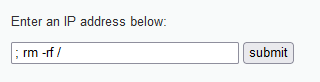

## Injection SQL

Je commence par ouvrir le code source : ça ressemble au cas le plus basique d'injection SQL, le texte que je donne est inséré "naïvement" dans une requête et sera donc traité tel quel comme une partie de celle-ci. Plus précisément, il est inséré entre deux guillemets, ce qui veut dire que mon input sera bien "confinée" dans une chaîne de caractère (et donc pas parsée comme code SQL), tant que je ne décide pas de sortir de celle-ci.  

Je vérifie ça en inputtant un simple guillement : effectivement, le site m'affiche une erreur, due au fait que mon input ferme la chaine de caratère, ce qui fait que le 2ème guillemet déjà présent dans le code ne fait pas de sens.   

Cela signifie surtout que si je met un giullement simple au début de ma requête, le reste est traité comme faisant partie de la requête (à la suite du user_id = '').  Le problème c'est qu'après mon input il y aura toujours la fin de la requête de base (ce qu'il y avait après l'endroit où mon input est insérée), à savoir le guillemet fermant qui causera le plus souvent une erreur ; il me suffit de placer "-- " à la fin de ma requête pour que tout ce qui vient après soit traité comme commentaire (l'espace est important), mon input devant donc fonctionnellement la fin de ma requête. 

Maintenant entre le ' et le -- je fais un peu ce que je veux : 
- comme suggéré par le sujet, je peux ajouter "or 1 = 1" : 1 = 1 est une condition toujours vraie, "cond or vrai" donnera toujours vrai, donc la condition de la requête, qui à la base n'est vraie que pour la bonne ligne, devient vraie tout le temps donc je récupère toutes les lignes de la table users. 
- Ca ne m'est pas "utile" dans la mesure où j'ai le code, je vois la requête, mais si je veux savoir combien de colonnes renvoie la requete de base, je peux utiliser `order by n` avec n un entier, ce qui cause une erreur si et seulement si n est supérieur au nombre de colonnes renvoyé : si la requête plante avec n = i mais pas avec n = i - 1, je sais qu'il y a i - 1 colonnes.  
- Je peux également utiliser union pour commencer une autre requête SELECT (et ajouter ses résultats à ceux de la requete de base)
    - Je commence par SELECT @@version (donc j'ai `' union SELECT @@version -- `) : pas d'erreur de syntaxe (donc je sais que je suis bien chez MySQL d'ailleurs, même si c'était explicite dans le code), mais j'ai une erreur car j'essaie d'unir deux tables avec des nombres de colonne différents ; la première requête donnant deux colonnes, il faut que la 2ème en fasse de même donc : `' union SELECT @@version, @@version -- `. Victoire : le serveur m'indique qu'il éxécute la version 5.1.41 de MySQL. Et puis quitte à devoir mettre deux colonne, je peux tester deux commandes en même temps.
    - Même chose avec @@hostname, qui donne dvwa. 
    - database() donne dvwa  
    - @@datadir donne 
    - Quitte à devoir mettre deux colonnes ont fait d'une pierre deux coups, current_user() et user() donnent tous les deux dvwa@
    - La liste des BD gérées par ce SGBD, obtenue avec `' union SELECT @@version, schema_name from information_schema.schemata -- ` est, outre information_schema, cdcol, dvwa, mysql, phpmyadmin, test 
    - La base "dvwa" contient les tables : users, guestbook (`' union SELECT @@version, table_name from information_schema.tables where table_schema = 'dvwa' -- `). La table "phpmyadmin" contient les suivantes : 
     (ce qui a l'air d'être super intéressant pour un attaquant mais je n'ai plus le temps de creuser)
    - La table users contient les colonnes (j'arrête avec les captures d'écran je pense qu'on a compris) : user_id, first_name, last_name, user, password, avatar (`table_name, column_name from information_schema.columns where table_name = 'users'`)
    - A noter que jusqu'ici je fais des requêtes avec <= 2 colonnes, donc j'ai toujours soit juste assez soit trop peu de colonnes pour l'union avec la requete de base ; mais si je veux récupérer + de 2 colonnes, je peux utiliser concat pour ramener le nombre de colonnes réellement renvoyées à 2 : par exemple si je veux récupérer toutes les données de la table user d'un coup, `' union select user, concat(password,0x3a,first_name,0x3a,last_name) from users -- `

    - Grâce à cette information je peux aller chercher les mots de passe des utilsateurs avec `' union SELECT user_id, password from users -- ` 
    - Avec `' union select user, password from mysql.user -- ` je peux obtenir les utilsateurs enregistrés au niveau de mysql. Je remarque que les mots de passe sont vides même pour root : aucune idée de si ça vient d'un problème avec ma requête ou d'une mauvaise configuration de la BD. 
    - Avec les privilèges suffisants, la fonction SQL load_file permet de charger un fichier et insérer sont contenu dans la requête. En exploitant le fait que "SELECT texte;" sans rien d'autre renvoie le texte tel quel, je peux charger un fichier de l'ordinateur hôte avec `' union select 1, load_file('filename') -- `. Voici le contenu "/etc/passwd" .  
    Par contre avec /etc/shadow, suggéré dans le sujet, je n'obtiens rien.  

## Éxécution de commande

Ici, le serveur attend une adresse IP : il va éxécuter `ping monip`, sans vérifier le contenu de monip.  

C'est donc le même cas que pour l'injection SQL, dans le sens où mon input ne devrait avoir aucun effet tant qu'elle n'est traitée que comme argument de ping (si mon input n'est pas une IP, mais reste une simple chaine alphanumérique, des espaces, etc, rien ne se passe) ; mais si mon input contient des caractères qui indiquent au shell utilisé par PHP de terminer l'appel de ping et passer à une nouvelle commande, le reste de mon input sera éxécuté comme commande. C'est même encore plus facile, vu que mon input n'est pas insérée mais concaténée : il n'y aura rien après mon input.  

Comme suggéré par le sujet, je peux : 
- Envoyer la sortie de la commande (avec comme IP 127.0.0.1 pour que ça marche) dans /dev/null avec `> /null/dev` , ce qui n'affiche rien car la sortie a été redirigée vers le fichier device null (qui sert de poubelle à sortie), mais a quand même fonctionné, d'où les 3s d'attente.  
- Envoyer la sortie d'erreur vers stdout avec `2>&1`, ce qui fait que je vois les messages d'erreur (le serveur ne me montre que les sorties normales stdout, pas les erreurs). Pratique pour "débugguer" ma tentative d'attaque.  


Et le plus important : en bash, & ou ; après une commande signifie que l'on entre une seconde commande (avec des modalités différentes selon si on a fait &, ;, &&, ||, etc).  
Je peux donc commencer mon input par ";", le reste sera traité comme commande.  
Je teste avec un simple ls -l :  


Je peux également me déplacer avant d'éxécuter la commande, par exemple ici j'affiche le contenu du répertoire racine :   


Ou alors faire ça, mais très franchement ne sachant pas si cette version de Debian date d'avant l'introduction de --no-preserve-root je vais éviter de vérifier si ça marche bien   



Commandes demandées par le sujet : 
- `; id ; uname -a ; pwd ` : 
- `; ifconfig` :   
  
Et là je manque de temps donc pour tout ce qui est table de routage et ports on va passer

De manière plus générale, on a vraiment le champ libre, quasiment comme si on avait un terminal ouvert sur la machine avec les mêmes privilèges que le serveur PHP lui-même (et ils ne sont pas faibles clairement).

Par exemple, je peux sans prpoblème afficher les hashs de mots de passe des users avec `; cat /etc/passwd`, assez critique.

Sinon, j'admet que je ne m'attendait pas à cet effet, mais une commande qui lance un processus interactif avancé comme `nano` va complètement planter le serveur ; impossible d'envoyer une autre input ou même de recharger la page ou un autre.  

Et puis comme j'arrive à la fin du TP je peux me permettre de bousiller la machine (tant qu'elle est virtuelle) donc on teste avec la fameuse fork bomb bash : 

  
Mais ça ne marche pas la VM va bien :(  


## CSRF
On a là un formulaire de changement de mot de passe dont le fonctionnement est un peu trop simple. Quand on clique sur Change, le script de la page prend simplement le contenu des deux input, les insère dans une URL, et envoie une requête avec cette URL au serveur, qui sans se poser trop de questions effectue les actions indiquées dans cette URL, notament un changement de mot de passe si les champs password_new et password_conf y sont présents. Autre problème : l'URL est affichée en clair dans la barre des taches.  

Donc, problème : il suffit d'envoyer une requête avec cette URL depuis un navigateur sur lequel l'user est loggé pour qu'elle affecte le mot de passe, peu importe de quelle manière on l'envoie.  

Déjà pour tester, je remplis les champs sur le site et appuie sur le bouton pour affiche l'URl dans la barre de navigation, puis j'édite manuellement les champs avant de soumettre à nouveau l'URL (dans le même onglet puis dans un nouveau, pour être sûr), en commençant par leur donner une valeur différente pour confirmer que j'ai bien "Passwords did not match", puis avec la même valeur dans les deux ; je vérifie ensuite que le hash enregistré dans le BD.  
Ca tombe bien, je connais justement une vulnérabilité qui permet de faire ça ...  
`' union select first_name, password from users -- `

Maintenant, le but est d'éxécuter cette requête à l'insu de l'utilisateur. 

Pour cela, je crée une petite page web, qui tente donne l'illusion une page du site paypal, et qui incite subtilement l'utilisateur à cliquer sur un lien, ce dernier ayant pour href une URL contenant les champs de modification de mot de passe. 


```html
<html>
    <head>
        <title>I am Paypal trust me</title>
    </head>
    <body>
        <br>
        Wzlcome to Paypal. <br>
        <a href="http://192.168.56.101/vulnerabilities/csrf/?password_new=hacked&password_conf=hacked&Change=Change#">Click here to obtain 2000$ for free on your account !!</a>
    </body>
</html>
```

Lorsque l'utilisateur cliquera sur ce lien, son mot de passe sera changé en "hacked", je peux donc me connecter à son compte en utilisant ce mdp. Il ne me reste plus qu'à le faire arriver sur cette page d'une manière ou d'une autre, via un mail frauduleux par exemple.  

Un défaut de cette technique est que l'utilisateur est amené par le lien sur la page DVWA de changement de mot de passe ; il se rend donc compte, a priori, qu'il vient de se passer quelque chose.  
Ma première idée de solution à ça a été de remplacer la ref de la balise lien par un `javascript:void(0);` avec un `onclick` appelant une fonction JS définie dans une balise script, qui utilise `fetch` pour effectuer la requête sans pour autant changer de page. Malheureusement ces satanées politiques CORS interdisent la requête ...  
Vu qu'on peut faire la requete avec un lien basique je me dis qu'il doit bien y avoir une autre manière de faire ça, mais mes connaissances en web sont franchement trop limitées.  

> Dans un monde idéal où les navigateurs ne seraient pas sécurisés, je pourrais même pousser l'imposture en volant une page du site pour lequel j'essaie de me faire passer. Par exemple, DVWA lui-même, qui présente l'avantage d'être simple. Je pourrais aller sur une des pages, copier le code HTML, l'éditer de manière à remplacer tous les chemins relatifs (pour le chargement des images, styles, etc) par l'IP/nom de domaine par lequel on accède au site (voir example plus bas), afin que la page soit chargée plus ou moins comme si on était en train d'interagir avec le vrai site, pour une illusion totale ; malheureusement, les navigateurs modernes refusent de charger des ressources depuis un autre domaine à cause des politiques de CORS ...

